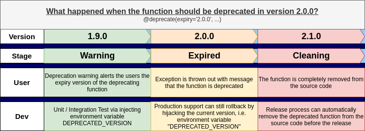

===============
Auto deprecator
===============

.. image:: https://img.shields.io/pypi/v/auto_deprecator.svg
        :target: https://pypi.python.org/pypi/auto-deprecator

.. image:: https://travis-ci.org/auto-deprecator/auto-deprecator.svg
        :target: https://travis-ci.org/auto-deprecator/auto-deprecator

.. image:: https://readthedocs.org/projects/auto-deprecator/badge/?version=latest
        :target: https://auto-deprecator.readthedocs.io/en/latest/?badge=latest
        :alt: Documentation Status

.. image:: https://img.shields.io/pypi/dm/auto-deprecator.svg

Deprecation toolkit in Python

* Free software: MIT license
* Documentation: https://auto-deprecator.readthedocs.io.

How does it work?
-----------------

The library provides the full cycle to deprecate a function in the following ways

1. Alert the users the deprecation time
#######################################

When the user calls the methods or initializes the objects which will be deprecated 
in the next version or on an expected date, the user should receive the warning of
the future deprecation but get the return in success.

.. code-block:: python

  from auto_deprecator import deprecate

  @deprecate(expiry='2.0.0', current='1.9.0')
  def old_hello_world():
      return print("Hello world!")

.. code-block:: python

  >>> old_hello_world()
  Hello world!
  DeprecationWarning: The function "old_hello_world" will be deprecated on version 2.0.0

2. Test as if deprecated
########################

Before the component is deprecated, unit / integration testing should be run
to ensure the deprecation does not break the existing flow. Pass in the environment
variables in the testing to simulate that the version is deployed.

.. code-block:: console

  (bash) hello-world-app
  Hello world!
  DeprecationWarning: The function "old_hello_world" will be deprecated in version 2.0.0
   
.. code-block:: console

  (bash) DEPRECATED_VERSION=2.0.0 hello-world-app
  Traceback (most recent call last):
   ...
  RuntimeError: The function "old_hello_world" is deprecated in version 2.0.0
 

3. Automatic deprecation before release
#######################################

Deprecating the functions is no longer a manual work. Every time before release,
run the command `auto-deprecate` to remove the functions deprecated in the coming
version.

.. code-block:: console

  (bash) auto-deprecate hello_world.py --version 2.0.0
  (bash) git diff

  diff --git a/hello_world.py b/hello_world.py
  index 201e546..ec41365 100644
  --- a/hello_world.py
  +++ b/hello_world.py
  @@ -1,8 +1,2 @@
  -from auto_deprecator import deprecate
  -
   def hello_world():
       return print("Hello world!")
  -
  -@deprecate(expiry='2.0.0')
  -def old_hello_world():
  -    return print("Hello world!")
  

Installation
------------

The library can be easily installed with pip

.. code-block:: console

  pip install auto-deprecator

Alternative Installation
------------------------

If the auto-deprecator is included and the functions are
well deprecated (following the whole cycle mentioned above),
your software does not need auto-deprecator anymore. For
developers who are not comfortable to include a library not
always in use as a dependency, they can just clone the source
code into your project instead.

For example, your Python project contains a module called
"utils" to maintain all the utility functions.

.. code-block:: console

  .
  ├── setup.py
  └── test_py_project
      ├── cli.py
      ├── __init__.py
      ├── test_py_project.py
      └── utils
          └── __init__.py

With the bash command "curl",

.. code-block:: console

  curl -L https://github.com/auto-deprecator/auto-deprecator/tarball/master | tar xz -C <target_directory> --wildcards "*/auto_deprecator" --strip-components=1

the source code of auto-deprecator can be cloned into the
target directory, i.e. "test_py_project/utils" in the example

.. code-block:: console

  touch test_py_project/utils/__init__.py
  curl -L https://github.com/auto-deprecator/auto-deprecator/tarball/master | tar xz -C test_py_project/utils --wildcards "*/auto_deprecator" --strip-components=1

Features
--------

Provide hints to users
######################

Provide the parameter "relocate", the warning / error message will inform the user about 
the relocated method.

.. code-block:: python

  @deprecate(expiry='2.1.0', current='2.0.0', relocate='new_compute_method')
  def compute_method():
      return 'hello world'

.. code-block:: python

  >>> old_hello_world()
  Hello world!
  DeprecationWarning: The function "old_hello_world" will be deprecated on version 2.0.0..
                      Please use method / function "new_compute_method".

Import current version from module name
#######################################

Instead of importing the version (`__version__`) in the module,

.. code-block:: python

  from your_package import __version__

  @deprecate(expiry='2.1.0', current=__version__)
  def compute_method():
      return 'hello world'

specifying the module name, which includes the version attribute, can
help maintain the source code in a clean manner.

.. code-block:: python

  @deprecate(expiry='2.1.0', version_module='your_package')
  def compute_method():
      return 'hello world'

Especially if the function is removed by the action `auto-deprecate`,
the unused import will not be left in the module.

Customize the deprecation handling
==================================

By default, the `deprecate` decorator raise `DeprecationWarning` for the future expiry and `RuntimeError` on the expiration. The behavior can be modified so as to fit in the infrastructure / production environment.

For example, the `DeprecationWarning` can be replaced by a simple print out by injecting a callable function into the parameter `warn_handler`.

.. code-block:: python

  @deprecate(expiry='2.1.0', current='2.0.0', warn_handler=print)
  def compute_method():
      return 'hello world'

Same for injecting a callable function into the parameter `error_handler`, the behavior is replaced if the function is deprecated.
